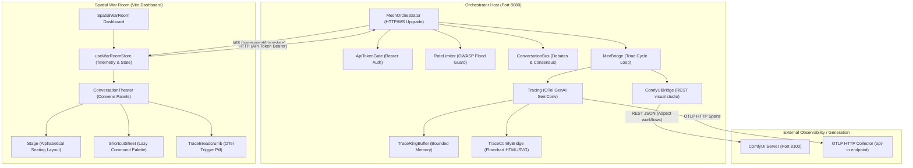

# Kovael Sovereign Showcase & Threat Model

Welcome to the Kovael Operator Showcase. This document proves the security, reliability, and public impressiveness of Kovael's multi-agent sovereign debate mesh.

---

## 1. Core Architectural Layout

Kovael separates local-first, low-overhead agent collaboration from spatial cockpit presentation. The core interfaces communicate via high-performance WebSocket streams and strict HTTP Bearer-authenticated REST endpoints.



---

## 2. Threat Model (STRIDE Framework)

Kovael is designed defensively to operate in untrusted environments. Below is our threat analysis and mitigation ledger:

| Threat Category | Potential Attack Vector | Kovael Defensive Mitigation |
|:---|:---|:---|
| **Spoofing Identity** | Malicious network nodes spoofing agent identity tags or connection handshakes. | **A2A Handshake & WS Bearer Auth**: WebSocket connections require Bearer token validation at the HTTP Upgrade level. Cryptographic keys are rotated via `MevHandshake` and signed with ES256. |
| **Tampering** | Intercepting HTTP/WS communications or tampering with generated blueprints and traces. | **ZTNP Receipts**: Every finished execution cycle generates a Zero Trust Node Protocol (ZTNP) receipt that embeds the cryptographic task hash and OTel trace context, persisted strictly in a SQLite ledger. |
| **Repudiation** | An agent denies taking an action, executing a tool, or contributing a debate turn. | **Immutable SQLite Ledger**: All message exchanges, dispatches, claims, releases, and verifications are permanently recorded in the STRICT SQLite database. |
| **Information Disclosure** | Leakage of API keys, bear tokens, or raw proprietary prompt datasets in telemetry logs. | **Secrets Redaction**: Automatic filters scrub headers, prompts, and payloads from output traces. The `validate-pr.mjs` pre-commit script screens changed files for high-confidence secret signatures. |
| **Denial of Service** | WS upgrade floods, telemetry overload, or VRAM saturation from concurrent model requests. | **OWASP Flood Guard & VRAM Governor**: Upgrade storms are rate-limited. Local inferences are serialized via static promise-chain mutexes. Telemetry pauses during cockpit idle, and dispatches failover off-GPU when utilization exceeds 90%. |
| **Elevation of Privilege** | Prompt injection attacks or malformed payloads executing shell commands on the host machine. | **No-Shell Invariant**: The ComfyUI Asset Studio utilizes strict JSON-only REST payloads. Executions inside `WorkspaceToolRunner` are checked against a resolved realpath-guard, fully blocking traversal escapes. |

---

## 3. Operational Runbook

### A. Quick Start Demo (No live agents required)
Kovael provides a high-fidelity cockpit demonstration fixture that simulates multi-agent dispatches, OTel timelines, and Comfy UI asset portrait triggers out of the box.

1. **Install Dependencies**:
   ```bash
   npm install
   ```
2. **Launch the Demo**:
   ```bash
   npm run showcase
   ```
3. **Open the Cockpit**:
   Navigate to `http://localhost:5173/?demo=true` in your browser. Toggle keyboard shortcuts using `?` or `Esc` to access the lazy ShortcutSheet command palette.

### B. Production Launch
To boot Kovael with live hardware sensing, rate limits, and actual LLM connectors:

1. **Verify VRAM telemetries and API keys**:
   Ensure `GOOGLE_API_KEY` or `OPENAI_API_KEY` is loaded on your environment path if local GPU overhead must be bypassed.
2. **Boot the Sovereign Mesh**:
   ```bash
   npm run start
   ```
3. **Inspect Active Spans**:
   Access the OTEL Trace inspector directly via the `TraceBreadcrumb` component or leverage standard OTLP HTTP collectors.
