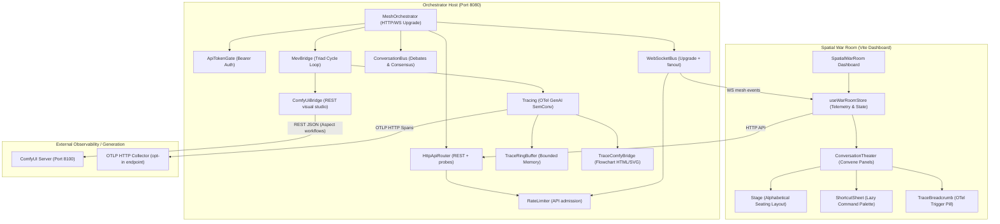

# Kovael Sovereign Showcase & Threat Model

Welcome to the Kovael Operator Showcase. This document summarizes the current
security, reliability, and demo surfaces of Kovael's multi-agent mesh.

---

## 1. Core Architectural Layout

Kovael separates local-first, low-overhead agent collaboration from spatial
cockpit presentation. The core interfaces communicate through WebSocket
streams and HTTP APIs; bearer authentication is opt-in through
`KOVAEL_API_TOKEN`.



---

## 2. Threat Model (STRIDE Framework)

Kovael is designed defensively for local and private-mesh environments.
Below is the current threat analysis and mitigation ledger:

| Threat Category | Potential Attack Vector | Kovael Defensive Mitigation |
|:---|:---|:---|
| **Spoofing Identity** | Malicious clients spoofing agent identity tags or WebSocket handshakes. | **Opt-in Bearer Auth + Session Binding**: `ApiTokenGate` protects `/api/v1/*`, `/metrics`, and WS upgrades when `KOVAEL_API_TOKEN` is set. Chair mutations require the current `sessionId`, and telemetry broadcasts overwrite client-supplied `type` and `nodeId`. |
| **Tampering** | Intercepting HTTP/WS communications or tampering with cycle evidence. | **Receipts + Append-Only CycleLog**: `MevBridge` verification receipts carry the task hash, phase trail, and routing evidence. `CycleLog` stores append-only cycle events and can seal a cycle with a Merkle-root receipt. |
| **Repudiation** | An agent denies taking an action, executing a phase, or contributing a debate turn. | **Structured Event History**: Chair events, cycle events, conversation history, and verification receipts are written through SQLite-backed services where available and replayed through the orchestrator state surfaces. |
| **Information Disclosure** | Leakage of API keys, bearer tokens, raw prompts, or oversized telemetry. | **Token Scrubbing + Bounded Payloads**: WS query tokens are removed before downstream handling, Comfy metadata logs prompt hashes instead of raw prompt text, trace payloads are sanitized and bounded, and `validate-pr.mjs` scans changed files for high-confidence secrets. |
| **Denial of Service** | WS upgrade floods, slow-drip bodies, oversized payloads, or VRAM saturation. | **Admission Limits**: HTTP timeouts, API rate limits, WS upgrade rate limits, WS `maxPayload`, JSON body limits, and VRAM-gated routing keep abusive or overloaded paths bounded. |
| **Elevation of Privilege** | Prompt injection attacks or malformed payloads attempting host command execution. | **Narrow Runtime Surfaces**: ComfyUI requests are strict JSON workflows with sanitized mixer values, workspace paths are constrained by `WorkspaceManager`, and the orchestrator does not expose a general shell execution API. |

---

## 3. Operational Runbook

### A. Quick Start Demo (No live agents required)
Kovael provides a high-fidelity cockpit demonstration fixture that simulates multi-agent dispatches, OTel timelines, and Comfy UI asset portrait triggers out of the box.

1. **Install Dependencies**:
   ```bash
   npm install
   ```
2. **Launch the Demo**:
   ```bash
   npm run showcase
   ```
3. **Open the Cockpit**:
   Navigate to `http://localhost:5173/?demo=true` in your browser. Toggle keyboard shortcuts using `?` or `Esc` to access the lazy ShortcutSheet command palette.

### B. Production Launch
To boot Kovael with live hardware sensing and chair routing:

1. **Build the orchestrator**:
   ```bash
   npm run build
   ```
2. **Boot the mesh**:
   ```bash
   npm start
   ```
3. **Inspect Active Spans**:
   Access the OTel trace inspector through the `TraceBreadcrumb` /
   `TraceTimeline` cockpit components, or set `OTEL_EXPORTER_OTLP_ENDPOINT`
   to export spans to an OTLP HTTP collector.
